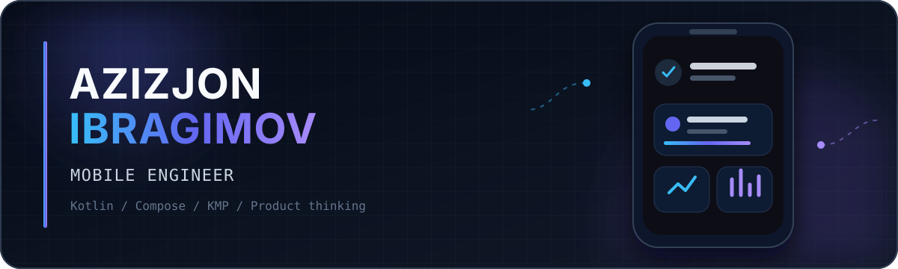

  

  
  

## Hey, I’m Azizjon 👋

I’m a mobile engineer from Dushanbe. Android has been my main platform for more than five years, but I enjoy looking beyond a single platform and thinking about the product as a whole.

I currently work on **Paydo**, a marketplace app where I build and improve catalog flows, maps, filters, pagination, reusable UI components, and app performance.

Before Paydo, I spent two years working on **MegaFon Life**. My work there included VoIP, money transfers, video calls, and new services inside a super-app used by a large audience.

Kotlin is still the language I enjoy working with the most. Recently, I’ve been using **Kotlin Multiplatform** and **Compose Multiplatform** in my own projects to understand what is genuinely worth sharing between Android and iOS.

I like taking a feature from a rough idea to a working release, finding the slow or fragile parts of an app, and turning complicated requirements into simple mobile flows.

## What I’m working on

### [Quran Hifz](https://github.com/azizconi/quran_todo_kmp)

A personal Kotlin Multiplatform project for Quran memorization and revision. It includes daily learning plans, spaced repetition, audio playback, reminders, progress tracking, and shared Compose UI for Android and iOS.

`Kotlin Multiplatform` `Compose Multiplatform` `Room` `Ktor` `Koin` `Decompose`

### CleanSwipe

An iOS photo-cleaning app designed to make reviewing similar, duplicate, and blurry photos faster without making deletion feel risky.

`iOS` `Swift` `PhotoKit` `Product development`

## Tools I use

**Mobile:** Kotlin, Android SDK, Jetpack Compose, Android Views, KMP, Compose Multiplatform

**Architecture:** MVVM, MVI, Clean Architecture, multi-module architecture

**Async and data:** Coroutines, Flow, Retrofit, OkHttp, Ktor, Room, DataStore

**Dependency injection:** Hilt, Koin

**Quality:** Firebase, Espresso, Kaspresso, performance profiling

## Let’s connect

I’m always happy to talk about mobile architecture, product ideas, or that strange bug that only happens on one device.

[Telegram](https://t.me/azizjon_8) · [Email](mailto:azizjon.ibragimov@proton.me)

## Contribution trail

<picture>
  <source media="(prefers-color-scheme: dark)" srcset="https://raw.githubusercontent.com/azizconi/azizconi/output/github-contribution-grid-snake-dark.svg" />
  <source media="(prefers-color-scheme: light)" srcset="https://raw.githubusercontent.com/azizconi/azizconi/output/github-contribution-grid-snake.svg" />
  
</picture>
